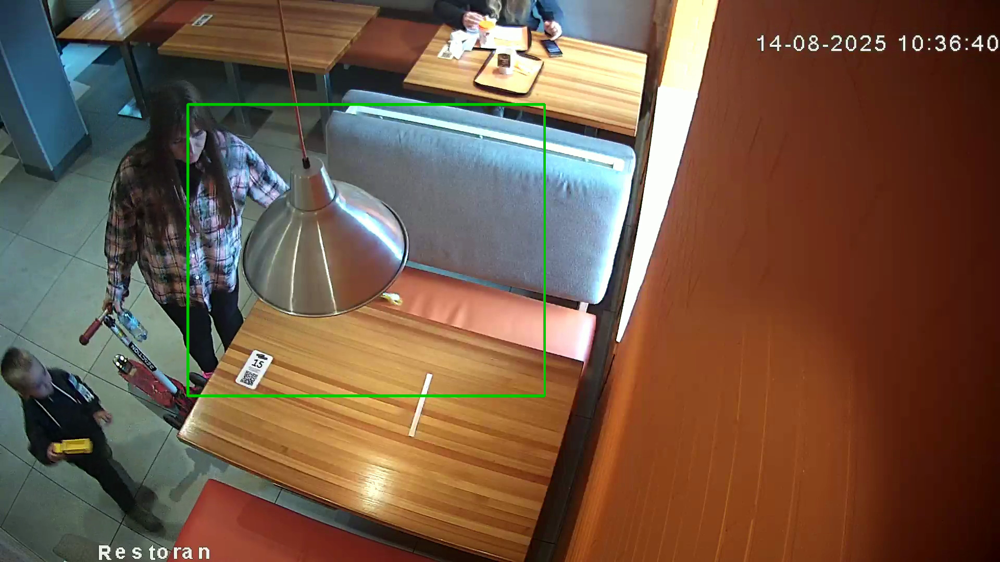

# Прототип детекции событий по столику (тестовое задание)

Этот репозиторий содержит:

- `main.py` — основной пайплайн детекции событий по **одному** столику.
- `scripts/` — setup, скачивание видео, запуск preset'ов и генерация HTML-отчётов.

## Краткий итог по ТЗ

Основной демонстрационный кейс в репозитории:
- видео: `data/video2.mp4`
- столик: ROI `(360, 200, 1045, 760)` из [`roi_presets/video2_table.json`](roi_presets/video2_table.json)
- логика: детекция людей (`YOLOv8n` как primary, плюс `motion` и `opencv-dnn` для сравнения), после чего поверх `in_zone_now` применяется простая FSM с событиями `EMPTY / APPROACH / OCCUPIED`
- полученный результат для этого видео: среднее ожидание `EMPTY -> следующий APPROACH = 156.33s`

Дополнительно в репозитории есть прогоны для `video1` и `video3`, но именно `video2` лучше всего подходит как короткий кейс под формулировку ТЗ, потому что для него есть валидная пара `EMPTY -> APPROACH`.

Проблемный кадр из `video2`:



На этом кадре человек подходит вплотную к столику и частично пересекает ROI, но система ещё не переводит стол в `OCCUPIED`, потому что по логике задания для этого требуется более устойчивое присутствие в зоне. Такой кадр хорошо показывает границу между `APPROACH` и подтверждённой занятостью.

## Установка (Python 3.8+)

### Самый короткий путь с нуля

```bash
git clone https://github.com/Dmitry-dev-pet/dodo-table-events.git
cd dodo-table-events
./scripts/setup.sh --with-videos
open publish/minimal/report.html
```

Этот сценарий:
- клонирует репозиторий
- поднимает окружение
- скачивает входные видео
- открывает уже готовый publish bundle без нового прогона

### Быстрый просмотр готового publish bundle

Если нужно просто скачать видео, поднять окружение и открыть уже подготовленный отчёт без нового прогона:

```bash
./scripts/setup.sh --with-videos
open publish/minimal/report.html
```

Это сценарий **без** `run.sh`:
- `setup.sh --with-videos` создаёт `.venv`, ставит зависимости, модели и скачивает `data/video1.mp4`, `data/video2.mp4`, `data/video3.mp4`
- `publish/minimal/report.html` открывает **уже собранный** publish bundle, который лежит в репозитории
- новый инференс и новый `out/` при этом не запускаются

Дополнительная генерация `publish/minimal` для этого сценария не нужна.

### Быстрый setup-скрипт

Базовая установка окружения:

```bash
./scripts/setup.sh
```

Скрипт:
- проверяет `python3`
- создаёт `.venv`, если её ещё нет
- ставит базовые зависимости из `requirements.txt`, если они ещё не установлены
- ставит YOLO runtime:
  - Python 3.8: через legacy-режим (`torch 1.13.1` + `ultralytics 8.0.13`)
  - Python 3.9+: через `pip install "ultralytics>=8,<9"`
- создаёт `data/`, `models/`, `out/`
- проверяет versioned-модели в `models/`
- всегда проверяет наличие `data/video1.mp4`, `data/video2.mp4`, `data/video3.mp4`

Скачать видео из ТЗ можно явным флагом:

```bash
./scripts/setup.sh --with-videos
```

Отдельно скачать только видео:

```bash
.venv/bin/python scripts/download_videos.py
```

### Полный локальный прогон

Единый запускной скрипт:

```bash
./scripts/run.sh --preset video1
```

По умолчанию он:
- берёт preset c видео и ROI
- запускает `main.py` с `--detector all`
- после прогона автоматически собирает детальный `<out-dir>/report.html`
- дополнительно обновляет единый `out/report.html` по всем найденным прогонам

Ручной режим:

```bash
./scripts/run.sh --video data/video1.mp4 --roi-json roi_presets/video1_table.json
```

Готовые preset'ы:

```bash
./scripts/run.sh --preset video1
./scripts/run.sh --preset video2
./scripts/run.sh --preset video3
./scripts/run.sh --preset all
```

Если нужен только `motion`, можно переопределить:

```bash
DETECTOR=motion ./scripts/run.sh --preset video1
```

То же через Rye:

```bash
rye run dodo-run --preset video1
```

После серии прогонов удобнее открывать один агрегированный файл:

```bash
out/report.html
```

Он показывает все найденные прогоны в `out/`, подтягивает видео, метрики и ссылки на детальные HTML-отчёты.

Рекомендуемый порядок для полного локального прогона:

```bash
./scripts/setup.sh
./scripts/setup.sh --with-videos
./scripts/run.sh --preset all
open out/report.html
```

Если нужен уже подготовленный publish bundle без нового прогона, главная точка входа:

```bash
publish/minimal/report.html
```

Это уже подготовленный bundle для публикации:
- он уже лежит в репозитории в готовом виде
- без `output.mp4`
- с общим HTML
- с детальными HTML по `video1/video2/video3`
- с минимальными данными для пересборки (`raw_frames.pkl`, `raw_people.jsonl`, `report.txt`)

В конце `setup.sh` summary теперь отдельно показывает:
- `yolo runtime`
- `yolo weights`

Если `primary` в отчёте не становится `yolo`, сначала проверь именно `yolo runtime`, а не только наличие весов.

Если нужно пропустить проверку моделей:

```bash
./scripts/setup.sh --skip-models
./scripts/setup.sh --skip-yolo-weights
```

### Вариант A: pip (как в ТЗ)

```bash
python -m venv .venv
source .venv/bin/activate
pip install -r requirements.txt
```

### Вариант B: Rye

```bash
rye pin 3.8
rye sync
```

## Линтер / форматирование

Используем `ruff` (работает на Python 3.8) и для линтинга, и для форматирования.

```bash
rye run lint
rye run fmt
```

## Минимальный bundle для публикации

Если не нужны видео и готовые HTML, можно собрать компактный набор артефактов для публикации:

```bash
.venv/bin/python scripts/export_min_artifacts.py
```

По умолчанию он складывает результат в `publish/minimal/` и копирует только:
- `raw_frames.pkl`
- `raw_people.jsonl`
- `report.txt`

Это минимальный набор, из которого можно:
- пересчитать события
- пересобрать HTML позже
- не тащить тяжёлые `output.mp4`

Если хочется сразу пересобрать HTML уже на минимальном наборе:

```bash
.venv/bin/python scripts/export_min_artifacts.py --with-html
```

То же через Rye:

```bash
rye run export-minimal-artifacts
```

## HTML-отчёт

HTML-отчёт **не обязателен по ТЗ** — это вспомогательный инструмент для отладки качества детекции и логики событий.
Он собирается **после прогона** `main.py` и использует уже сохранённые файлы (`output.mp4`, `raw_frames.*`, `events.csv`,
`raw_people.jsonl`), то есть **не запускает инференс заново**.

Что он даёт:
- Удобная проверка, что **видео и метрики синхронизированы** (ползунок времени управляет видео и вертикальной линией на графиках).
- Визуальный дебаг **порога overlap** и decision-логики.
- Просмотр событий `EMPTY/OCCUPIED/APPROACH` и метрик ожидания/касаний.
- Оверлей bbox людей поверх видео, чтобы видеть **что именно “видит” детектор**.
- Редактирование ROI прямо в detail report с локальным сохранением.
- При запуске `--detector all` можно переключать источник графиков и overlay между `yolo`, `opencv-dnn`, `motion`, `all`.

Как открыть:
- Открой `out/report.html` или `publish/minimal/report.html`.
- Если браузер блокирует доступ к локальному видео из `file://`,
  подними простой локальный сервер:
  - `cd out && python -m http.server 8000`
  - затем открой `http://localhost:8000/report.html`

## Что сохраняется (v0.1)

Выходные файлы:
- `out/video*/output.mp4` — визуализация, если не использован `--no-video`
- `out/video*/events.csv` — таблица событий (`EMPTY|OCCUPIED|APPROACH`)
- `out/video*/report.txt` — краткий текстовый отчёт и метрики
- `out/video*/raw_frames.csv` / `out/video*/raw_frames.pkl` — временные ряды для дебага и графиков
- `out/video*/raw_people.jsonl` / `out/video*/raw_people.csv` / `out/video*/raw_people.pkl` — bbox людей
- `out/video*/report.html` — детальный оффлайн HTML-отчёт
- `out/report.html` — общий HTML-отчёт по всем найденным прогонам

Полезные флаги:
- `--max-seconds 60` — быстрый прогон
- `--detector all|auto|motion|opencv-dnn|yolo` (по умолчанию: `all`)
- `--no-video` — не писать `output.mp4`
- `--infer-every 5` (по умолчанию) — инференс раз в N кадров, промежуточные кадры используют последнее решение
- `--roi x1,y1,x2,y2` — без `cv2.selectROI`
- `--person-conf-min 0.05` — порог YOLO для **raw** боксов (ниже → больше детектов и мусора)
- `--person-conf-used 0.15` — порог YOLO для «used» боксов (по ним считаем занятость)
- `--overlap-min 0.10` — порог «стол занят» по доле ROI
- `--t-enter 20` / `--t-exit 20` — временной гистерезис входа/выхода (сек)
- `--t-approach 1` — дебаунс `APPROACH`: человек должен быть в зоне N секунд подряд
- `--t-empty-min 0` — `APPROACH` считаем после любой пустоты
- Если `output.mp4` не проигрывается в браузере, пересобери с `--fourcc avc1` или `--fourcc mp4v`.

## Примечания

- Базовая установка (Python 3.8+) работает **без Torch**: `motion` + `opencv-dnn`.
- YOLO опционально. На Python 3.8 используется «legacy» набор зависимостей (torch 1.13.1 + ultralytics 8.0.13).

## Что коммитить в Git

- Код + `README.md` + `pyproject.toml` (+ lock-файлы, если используешь Rye).
- Не коммитить артефакты запусков: `out/` в `.gitignore`.
- Коммитить versioned-модели в `models/`.
- Не коммитить входные видео: `data/` в `.gitignore`.

## Модели в репозитории

Основные модели лежат в репозитории и не требуют отдельного скачивания:

- `models/opencv_dnn/person_detection_mediapipe_2023mar.onnx`
- `models/opencv_dnn/person_detection_mediapipe_2023mar.anchors.npy`
- `models/yolov8n.pt`

Если их нужно восстановить локально вручную:

```bash
rye run dodo-download-models
rye run download-yolo-weights
```

## YOLO на Python 3.8 (legacy)

Если хочешь YOLO и при этом остаёшься на Python 3.8.x:

```bash
rye sync --features yolo38
```

Если `rye sync --features yolo38` не подтянул пакеты, используй:

```bash
rye run install-yolo38
```

Если YOLO падает при загрузке `models/yolov8n.pt` (несовместимость веса/версии Ultralytics), скачай совместимый вес:

```bash
rye run download-yolo-weights
```
